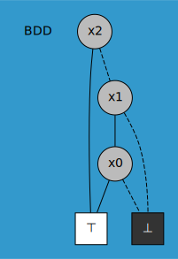

# bex-py

This is a python binding for the `bex` crate, a library for boolean expression manipulation. It is inspired by and intends to be mostly compatible with the `dd` package.

## Installation

```bash
pip install tangentstorm-bex
```

## Local Development

To install from a local clone of the repository:

```bash
# Install maturin if you don't have it
pip install maturin

# Build and install in development mode
cd py
maturin develop

# Or for an optimized release build
maturin develop --release
```

Alternatively, use pip directly:

```bash
cd py
pip install .
```

There's also a `go.sh` script that builds, installs, and runs the tests.

## Usage

Here's a simple example of how to use the `bex` module:

```python
import bex

# Create a BDD base
base = bex.BddBase()

# Create some variables
a = bex.nvar(0)
b = bex.nvar(1)

# Perform some operations
c = base.op_and(a, b)
d = base.op_or(a, b)

# Print the results
print(f"a & b = {c}")
print(f"a | b = {d}")
```

Here's a simple example of how to use the `dd_bex` module:

```python
from bex.dd import BDD

bdd = BDD()

bdd.declare('x0', 'x1', 'x2')

n = bdd.add_expr('(x0 & x1) | x2')

bdd.dump('and-or.svg', [n])

import webbrowser
webbrowser.open('and-or.svg')
```



## License

This project is licensed under the MIT License. See the `LICENSE` file for details.
